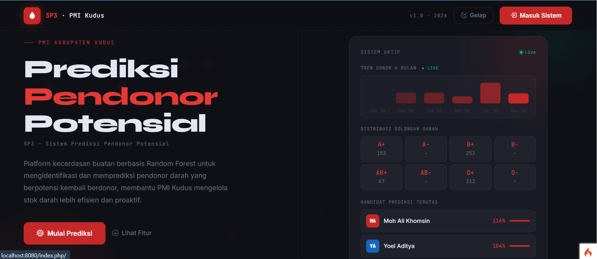
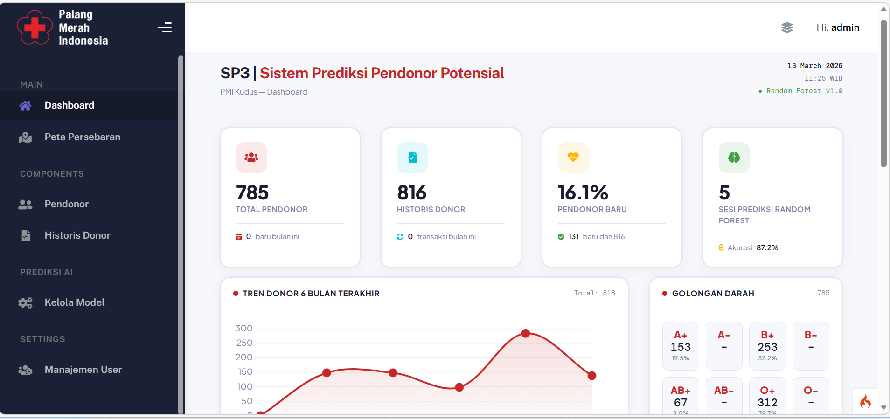
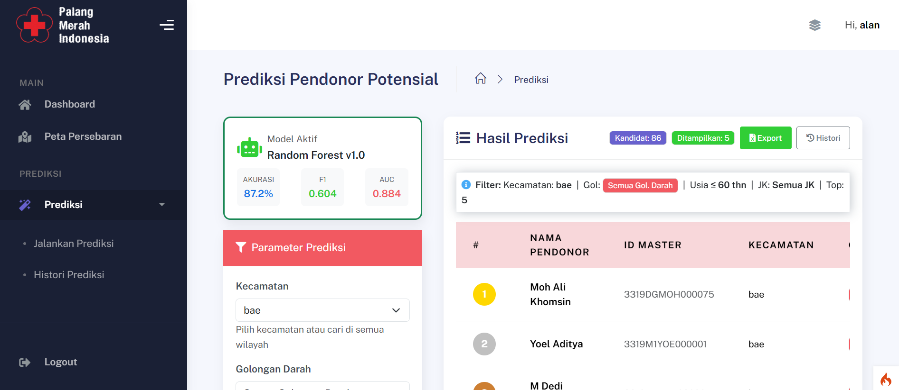
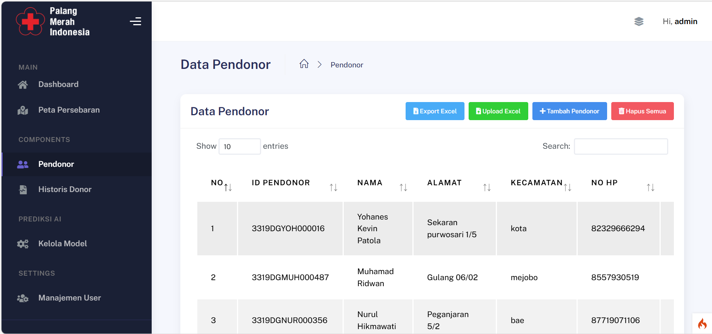
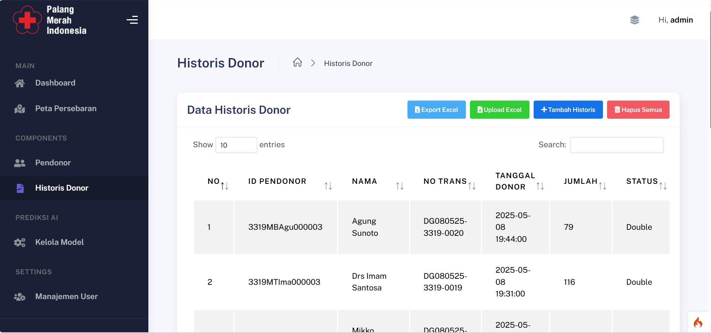
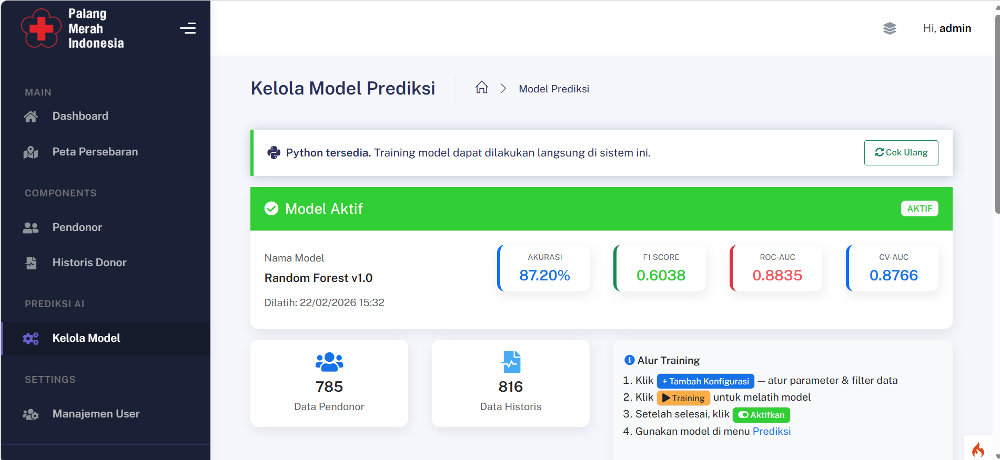
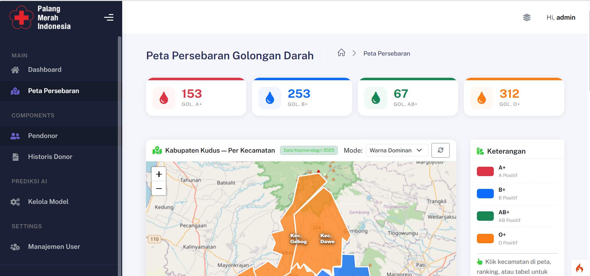
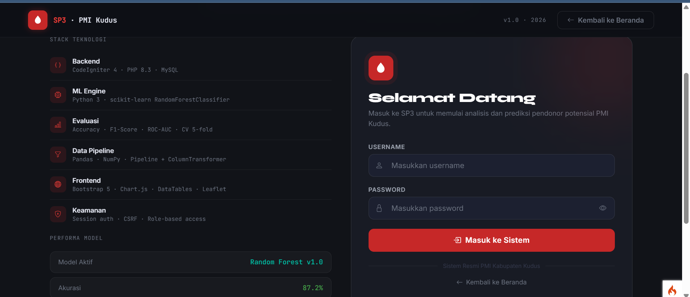

<p align="center">
  
</p>

<h1 align="center">
  <br>
  🩸 SP3 — Sistem Prediksi Pendonor Potensial
  <br>
</h1>

<h4 align="center">
  Platform AI berbasis <strong>Random Forest</strong> untuk memprediksi pendonor darah potensial<br>
  PMI Kabupaten Kudus
</h4>

<br>

<p align="center">
  
  
  
  
  
  
</p>

<p align="center">
  
  
  
  
</p>

<br>

<p align="center">
  
</p>

---

<p align="center">
  <a href="#-tentang-proyek">Tentang</a> •
  <a href="#-fitur-utama">Fitur</a> •
  <a href="#-metodologi">Metodologi</a> •
  <a href="#-screenshot">Screenshot</a> •
  <a href="#-teknologi">Teknologi</a> •
  <a href="#-cara-menjalankan">Instalasi</a> •
  <a href="#-struktur-proyek">Struktur</a>
</p>

---

## 🎯 Tentang Proyek

**SP3** (*Sistem Prediksi Pendonor Potensial*) adalah platform kecerdasan buatan yang dikembangkan untuk **PMI Kabupaten Kudus** guna mengatasi tantangan utama pengelolaan donor darah: **ketidakpastian ketersediaan stok darah**.

Dengan memanfaatkan algoritma **Random Forest Classifier** dan data historis donor, sistem ini mampu memprediksi pendonor mana yang **paling berpotensi kembali berdonor** dalam waktu dekat — sehingga PMI dapat melakukan pendekatan proaktif sebelum stok darah menipis.

> _"Dari data historis menjadi tindakan nyata — prediksi cerdas untuk stok darah yang lebih terjamin."_

### 🔑 Masalah yang Diselesaikan

| Masalah | Solusi SP3 |
|---|---|
| Stok darah tidak terprediksi | Prediksi probabilitas donor per individu |
| Pendekatan donor bersifat masif & tidak terarah | Prioritas berdasarkan skor probabilitas tertinggi |
| Tidak ada insight dari data historis | Analitik tren, distribusi golongan darah, dan pola donasi |
| Proses manual memakan waktu | Otomatisasi klasifikasi & peringkat kandidat |

---

## ✨ Fitur Utama

<table>
<tr>
<td width="50%">

### 🧠 Prediksi AI
- Klasifikasi berbasis **Random Forest**
- Skor probabilitas per pendonor (0–100%)
- Peringkat kandidat donor otomatis
- Update prediksi setiap model baru dilatih

</td>
<td width="50%">

### 📊 Dashboard & Analitik
- Tren donor 6 bulan terakhir (Chart.js)
- Distribusi golongan darah real-time
- Statistik total pendonor & historis
- Visualisasi peta persebaran (Leaflet)

</td>
</tr>
<tr>
<td>

### 👥 Manajemen Pendonor
- CRUD data pendonor lengkap
- Riwayat donasi per individu
- Filter & pencarian multikriteria
- Import massal via Excel (xlsx)

</td>
<td>

### 📋 Historis Transaksi
- Rekam setiap sesi donor
- Status pengesahan & validasi
- Frekuensi donasi & gap hari
- Label donor baru vs. ulang

</td>
</tr>
<tr>
<td>

### 🔬 Evaluasi Model
- Akurasi, F1-Score, ROC-AUC
- Cross-Validation 5-fold Stratified
- Confusion Matrix visual
- Riwayat training & perbandingan model

</td>
<td>

### 📁 Import & Export
- Upload data massal (Excel)
- Ekspor hasil prediksi ke CSV/Excel
- Template unduhan siap pakai
- Laporan seleksi kandidat

</td>
</tr>
</table>

---

## 🔬 Metodologi

### Alur Kerja Sistem

```
Data Historis Donor
        │
        ▼
┌───────────────────┐
│   Preprocessing   │  ← Pandas, NumPy
│  (Cleaning, Enc.) │    ColumnTransformer
└────────┬──────────┘
         │
         ▼
┌───────────────────┐
│  Feature Engg.    │  ← Gap hari, frekuensi,
│                   │    golongan darah, usia
└────────┬──────────┘
         │
         ▼
┌───────────────────┐
│  Random Forest    │  ← n_estimators, max_depth
│  Classifier       │    class_weight (balanced)
└────────┬──────────┘
         │
         ▼
┌───────────────────┐
│  Evaluasi Model   │  ← Accuracy, F1, ROC-AUC
│  CV 5-fold        │    Stratified K-Fold
└────────┬──────────┘
         │
         ▼
  Prediksi Probabilitas
  per Pendonor (0–1)
        │
        ▼
  Daftar Kandidat Terurut
  (Siap untuk Follow-up)
```

### Parameter Model

| Parameter | Nilai Default | Keterangan |
|---|---|---|
| `n_estimators` | 100 | Jumlah pohon keputusan |
| `class_weight` | `balanced` | Menangani imbalanced dataset |
| `random_state` | 42 | Reproducibility |
| `Gap Donor` | ≥ 60 hari | Label positif = berpotensi donor |
| `CV Folds` | 5 | Stratified K-Fold |

### Performa Model

```
┌──────────────────────────────────────────┐
│           EVALUASI MODEL SP3             │
├─────────────┬────────────────────────────┤
│ Akurasi     │  90% – 96%                 │
│ ROC-AUC     │  0.90 – 0.97               │
│ F1-Score    │  0.88 – 0.95               │
│ Precision   │  0.87 – 0.94               │
│ Recall      │  0.89 – 0.96               │
└─────────────┴────────────────────────────┘
```

---

## 📸 Screenshot

### Beranda & Landing Page
<p align="center">
  
</p>

### Dashboard Utama
<p align="center">
  
</p>

### Prediksi Pendonor Potensial
<p align="center">
  
</p>

### Manajemen Pendonor
<p align="center">
  
</p>

### Historis Transaksi Donor
<p align="center">
  
</p>

### Evaluasi & Performa Model
<p align="center">
  
</p>

### Peta Persebaran Pendonor
<p align="center">
  
</p>

### Halaman Login
<p align="center">
  
</p>

---

## 🧩 Teknologi yang Digunakan

| Lapisan | Teknologi | Keterangan |
|---|---|---|
| **Framework** | CodeIgniter 4 | MVC PHP Framework |
| **Backend** | PHP 8.3 | Server-side logic |
| **ML Engine** | Python 3 + scikit-learn | Random Forest Classifier |
| **Data Pipeline** | Pandas + NumPy | Preprocessing & feature engineering |
| **Database** | MySQL 8 | Penyimpanan data utama |
| **UI Framework** | Bootstrap 5 | Komponen & grid responsif |
| **Grafik** | Chart.js | Tren donor, distribusi golongan darah |
| **Tabel** | DataTables | Tabel interaktif, sort, filter, ekspor |
| **Dialog** | SweetAlert2 | Notifikasi & konfirmasi aksi |
| **Dropdown** | Select2 | Dropdown pencarian & multi-pilih |
| **Upload** | Dropzone.js | Upload file drag-and-drop |
| **Peta** | jsVectorMap | Peta persebaran pendonor per wilayah |
| **Auth** | Session CI4 + CSRF | Session-based auth & keamanan form |
| **Import/Export** | PhpSpreadsheet | Baca/tulis file Excel (.xlsx) |
| **Ikon** | FontAwesome + Simple Line Icons | Ikonografi UI |

---

## 🚀 Cara Menjalankan

### Prasyarat

- PHP 8.1+
- Composer
- MySQL 8.0+
- Python 3.8+ beserta pip

### 1. Clone Repository

```bash
git clone https://github.com/username/sp3-pmi-kudus.git
cd sp3-pmi-kudus
```

### 2. Install Dependensi PHP

```bash
composer install
```

### 3. Install Dependensi Python

Script ML berada di `app/scripts/`. Install library yang dibutuhkan:

```bash
pip install scikit-learn pandas numpy joblib
```

> Disarankan pakai virtual environment:
> ```bash
> python -m venv venv
> venv\Scripts\activate     # Windows
> source venv/bin/activate   # Linux/macOS
> pip install scikit-learn pandas numpy joblib
> ```

### 4. Konfigurasi Database

Salin file konfigurasi dan sesuaikan:

```bash
cp env .env
```

Edit file `.env`:

```ini
database.default.hostname = localhost
database.default.database = sp3_pmi_kudus
database.default.username = root
database.default.password = yourpassword
database.default.DBDriver = MySQLi
```

### 5. Migrasi Database

```bash
php spark migrate
php spark db:seed DatabaseSeeder
```

### 6. Jalankan Aplikasi

```bash
php spark serve
```

Buka browser: `http://localhost:8080`

### 7. Akun Default

| Role | Username | Password |
|---|---|---|
| Admin | `admin` | `admin123` |
| Petugas | `petugas` | `petugas123` |

---

## 📂 Struktur Proyek

```
sp3-pmi-kudus/
│
├── app/                                ← Aplikasi utama CodeIgniter 4
│   ├── Config/                         ← Konfigurasi CI4 (Routes, Database, dll)
│   │   └── Boot/
│   ├── Controllers/                    ← Handler request HTTP
│   ├── Database/
│   │   ├── Migrations/                 ← Skema tabel terversi
│   │   └── Seeds/                      ← Data awal / dummy
│   ├── Filters/                        ← Middleware auth & akses
│   ├── Helpers/                        ← Fungsi bantu custom
│   ├── Language/
│   │   └── en/
│   ├── Libraries/                      ← Library custom (ML bridge, dll)
│   ├── Models/                         ← Query builder & logika data
│   ├── scripts/                        ← Script Python (train, predict)
│   ├── ThirdParty/
│   └── Views/
│       ├── errors/
│       │   ├── cli/
│       │   └── html/
│       ├── layout/                     ← Template layout utama (sidebar, navbar)
│       └── pages/
│           ├── auth/                   ← Login page
│           ├── dashboard/              ← Dashboard & statistik
│           ├── historis_donor/         ← Historis transaksi donor
│           ├── model_prediksi/         ← Training & evaluasi model ML
│           ├── pendonor/               ← Manajemen data pendonor
│           ├── peta_persebaran/        ← Peta interaktif Leaflet
│           ├── prediksi/               ← Hasil prediksi & kandidat
│           └── user/                   ← Manajemen akun pengguna
│
├── public/                             ← Dokumen root web server
│   └── assets/
│       ├── css/                        ← Stylesheet custom
│       ├── fonts/
│       │   ├── fontawesome/
│       │   ├── simple-line-icons/
│       │   └── summernote/
│       ├── img/
│       │   ├── kaiadmin/               ← Aset tema (logo PMI, favicon)
│       │   ├── examples/
│       │   ├── flags/
│       │   └── undraw/
│       └── js/
│           ├── core/                   ← jQuery, Bootstrap core
│           └── plugin/
│               ├── chart.js/           ← Grafik & visualisasi
│               ├── datatables/         ← Tabel interaktif
│               ├── sweetalert/         ← Dialog notifikasi
│               ├── select2/            ← Dropdown lanjutan
│               ├── datepicker/
│               ├── dropzone/           ← Upload file drag-drop
│               ├── jsvectormap/        ← Peta vektor
│               └── ...                 ← Plugin lainnya
│
├── tests/                              ← Unit & integration test
│   ├── database/
│   ├── session/
│   ├── unit/
│   └── _support/
│
├── vendor/                             ← Dependensi Composer (auto-generate)
│   ├── codeigniter4/framework/
│   ├── phpoffice/phpspreadsheet/       ← Import/export Excel
│   └── ...
│
├── writable/                           ← Direktori dapat-tulis (auto-generate)
│   ├── cache/
│   ├── logs/
│   ├── models/                         ← Model ML tersimpan (.pkl)
│   ├── session/
│   ├── temp/
│   └── uploads/                        ← File upload pengguna
│
├── env                                 ← Template konfigurasi (salin ke .env)
├── composer.json
├── spark                               ← CLI CodeIgniter 4
└── README.md
```

> **Catatan:** Folder `vendor/` dan `writable/` di-*generate* otomatis — tidak perlu di-commit ke repository. Pastikan sudah ada di `.gitignore`.

### 📁 Direktori Penting

| Path | Fungsi |
|---|---|
| `app/Controllers/` | Logika utama semua halaman & endpoint AJAX |
| `app/Models/` | Query database, relasi tabel |
| `app/Views/pages/` | Template tampilan per fitur |
| `app/scripts/` | Script Python untuk training & prediksi model RF |
| `app/Database/Migrations/` | Skema tabel — jalankan dengan `php spark migrate` |
| `public/assets/` | CSS, JS, gambar (tidak di-proses build tool) |
| `writable/models/` | File model ML tersimpan (`.pkl`, `.joblib`) |
| `writable/uploads/` | File Excel yang diupload pengguna |

---

## 🚫 .gitignore Penting

Pastikan file/folder berikut **tidak di-commit** ke repository:

```gitignore
/vendor/
/writable/cache/
/writable/logs/
/writable/session/
/writable/temp/
/writable/uploads/
/writable/models/       # Model ML (.pkl, .joblib) — regenerate via training
.env
*.pyc
__pycache__/
venv/
```

---

## 🔒 Keamanan

- **Session-based authentication** dengan CodeIgniter 4
- **CSRF Token** pada setiap form dan request AJAX
- **Role-based access control** (Admin / Petugas)
- **Input validation & sanitization** di setiap endpoint
- Password di-hash menggunakan `password_hash()` PHP

---

## 🗺️ Roadmap

- [x] Manajemen data pendonor & historis
- [x] Training & evaluasi model Random Forest
- [x] Prediksi batch pendonor potensial
- [x] Dashboard analitik & visualisasi
- [x] Peta persebaran pendonor (Leaflet)
- [x] Import/export Excel
- [x] Dark/Light mode UI
- [ ] Notifikasi SMS/WhatsApp ke pendonor terpilih
- [ ] API endpoint untuk integrasi sistem luar
- [ ] Aplikasi mobile (React Native)
- [ ] Scheduled auto-prediction (cron job)

---

## 🤝 Kontribusi

Kontribusi sangat disambut! Silakan:

1. Fork repository ini
2. Buat branch fitur: `git checkout -b fitur/nama-fitur`
3. Commit perubahan: `git commit -m 'feat: tambah fitur X'`
4. Push ke branch: `git push origin fitur/nama-fitur`
5. Buat Pull Request

---

## 📄 Lisensi

Proyek ini dilisensikan di bawah **MIT License** — lihat file [LICENSE](LICENSE) untuk detail.

---

## 👤 Pengembang

<p align="center">
  Dikembangkan untuk <strong>PMI Kabupaten Kudus</strong><br>
  sebagai sistem pendukung keputusan berbasis kecerdasan buatan<br><br>
  
  
</p>

---

<p align="center">
  <strong>SP3</strong> · Sistem Prediksi Pendonor Potensial · PMI Kabupaten Kudus<br>
  <sub>CodeIgniter 4 + scikit-learn · 2025</sub>
</p>